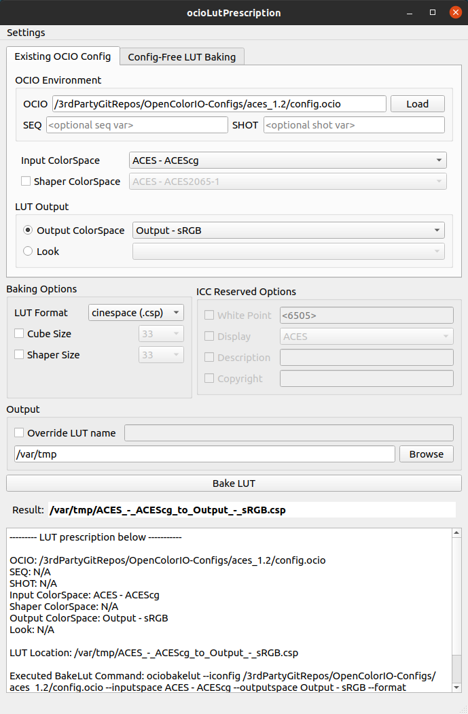
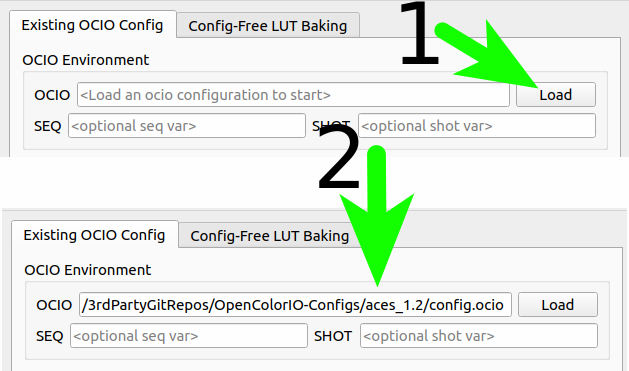
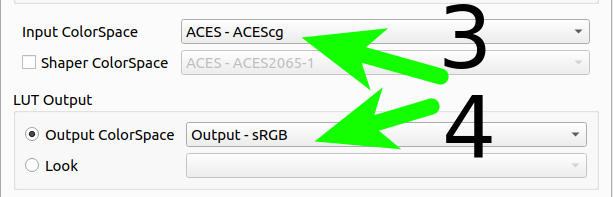
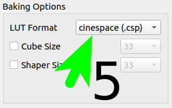
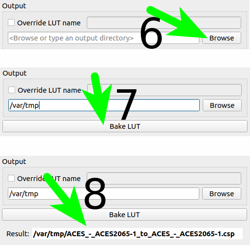
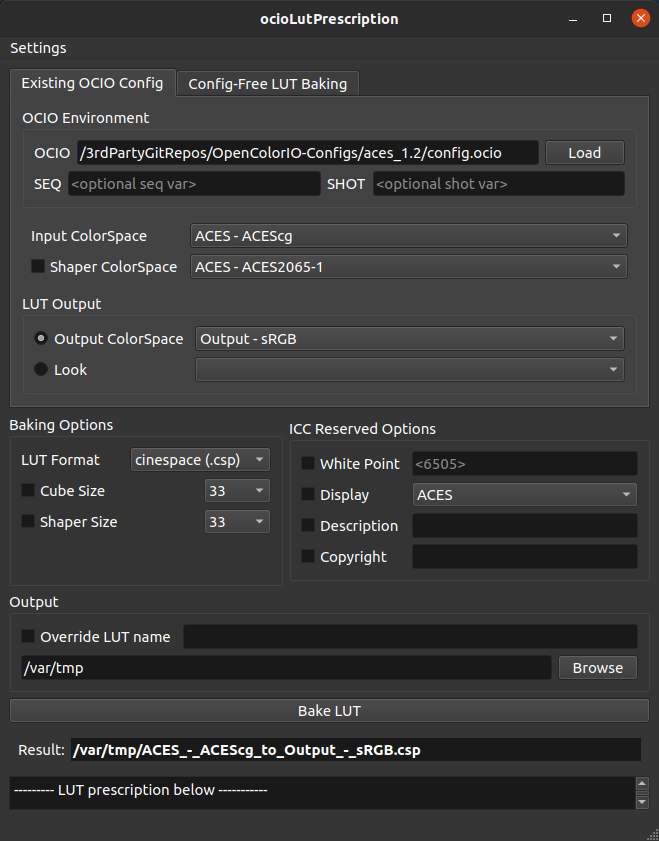
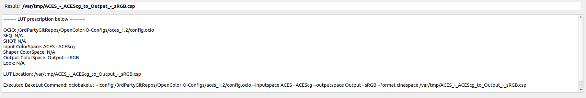

# ocioLutPrescription

---

##Summary
ocioLutPrescription is a gui tool used to wrap the ociobakelut command

---

## UI Overview

Note: If you are already familiar with ociobakelut, the ui should be fairly simple to figure out.

## Generate a LUT, step by step
### Load your ocio configuration

### Select Input and Output ColorSpace (or looks, if available)

### Select Lut Format

### Select Destination and bake

## Extra Features
- Persistent settings for ease of repeated use

- system/dark mode

- expand window for operation summary

## Prerequesites
- PyOpenColorIOv2
- python3.8

---

## install
`pip install ocioLutPrescription`

---

## execute
`ocioLutPrescription` (in Terminal)

---

## Release history

v1.0.0: initial release

---
## Misc

##### Icon copyright

---

##### Disclaimer

I'm not a doctor, those ain't real prescriptions.

---

