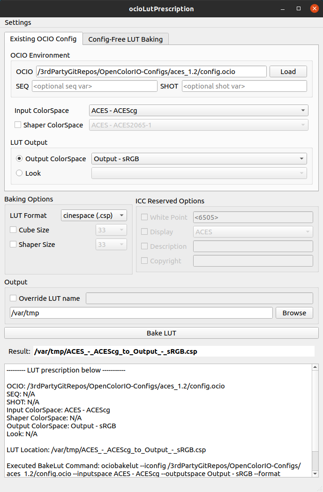
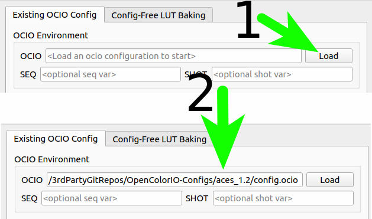
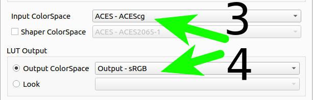
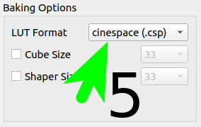
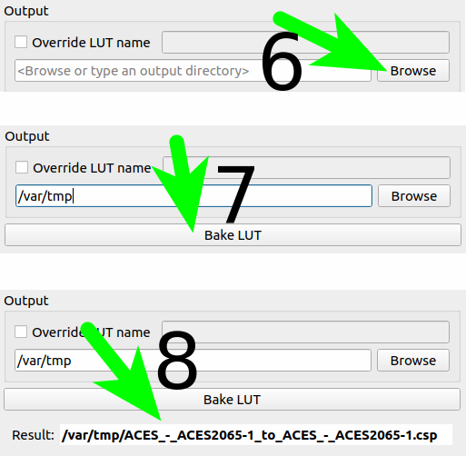
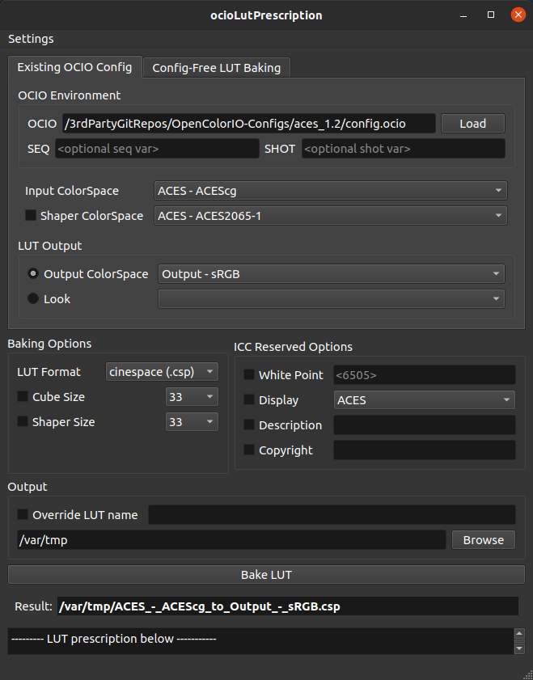
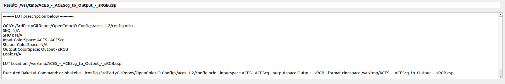

# ocio-lut-prescription

---

## Summary
ocio-lut-prescription is a gui tool used to wrap the ociobakelut command

---

## UI Overview

Note: If you are already familiar with ociobakelut, the ui should be fairly simple to figure out.

## Generate a LUT, step by step
### Load your ocio configuration

### Select Input and Output ColorSpace (or looks, if available)

### Select Lut Format

### Select Destination and bake

## Extra Features
- Persistent settings for ease of repeated use

- system/dark mode

- expand window for operation summary

## Prerequesites
- opencolorio>=2
- python>=3.8
- pyside2

---

## install
`pip install ocio-lut-prescription`

---

## execute
`ocio-lut-prescription` (in Terminal)

---

## tests
`tox` (in terminal) will run tests/pylint/black on the repo

## Release history

v1.0.0: initial release
v1.2.0: bug fixes, pylink update

---
## Misc

##### Icon copyright

---

##### Disclaimer

I'm not a doctor, those ain't real prescriptions.

---
